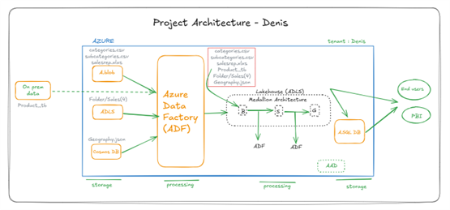

# Azure Data Engineering Project: Bronze Layer Ingestion

This project demonstrates the implementation of **Azure Data Factory (ADF)** pipelines to ingest raw data into the **bronze layer** in **Azure Data Lake Storage (ADLS)**.

### Key Pipelines:
- **Blob & ADLS to Bronze**: Loads CSV and Excel data from Blob Storage and ADLS into the bronze layer in ADLS.
- **On-prem MySQL to Bronze**: Ingests data from an on-prem MySQL database into the bronze layer.
- **Cosmos DB to Bronze**: Pulls JSON data from Cosmos DB and stores it in the bronze layer.

### Master Pipeline:
The **master pipeline** orchestrates the execution of all ingestion pipelines in parallel, ensuring that data is moved efficiently to the bronze layer.

### Folder Structure:
- `blob-adls-to-bronze-pipeline.md`: Pipeline description for Blob/ADLS to Bronze.
- `onprem-mysql-to-bronze-pipeline.md`: Pipeline description for MySQL to Bronze.
- `cosmosdb-to-bronze-pipeline.md`: Pipeline description for Cosmos DB to Bronze.
- `master-pipeline.md`: Description of the master pipeline for orchestration.
- `pipeline architecture`: Visual diagrams of the pipeline architecture.
