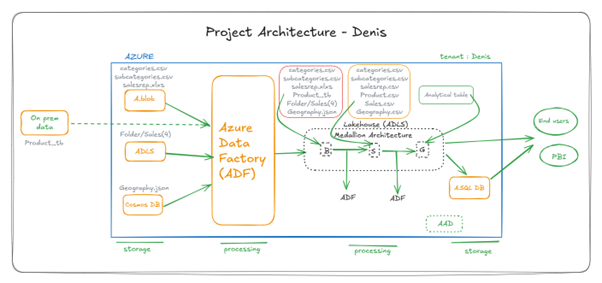

# 🥇 Gold Layer - Final Analytical Data

This folder contains the final curated dataset, ready for reporting and business analysis. It represents the **single analytical table** generated by combining all necessary data from the Silver layer.

## 🧠 Summary

- Created using **one final Dataflow**
- Joined all dimension and fact tables
- Removed unnecessary or redundant columns
- Applied final data cleaning and validation

## 🔁 Execution

- Executed through a dedicated ADF pipeline named `gold_pipeline`
- Output written to:
  - Azure Data Lake Storage (Gold zone)
  - Azure SQL Database (used for Power BI import mode)

## 📊 Usage

This table is directly connected to **Power BI** using **Import Mode** for dashboarding and reporting.

It serves as the single source of truth for analytics in the **DENIS Project**.
