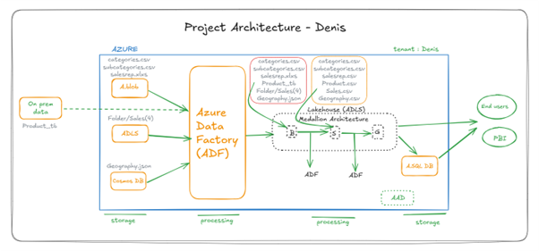

# 🥈 Silver Layer - Cleaned & Structured Data

This folder contains the transformed data moved from the Bronze layer after applying data cleaning and business logic. Data was processed using 6 Azure Data Factory (ADF) Dataflows.

## 📌 Structure

- `dimension/` → Contains 5 Dataflows handling dimension data.
- `fact/` → Contains 1 Dataflow that processes sales (fact) data.
- `pipeline/` → Details the pipeline that executes all 6 Dataflows.

## 🧹 Transformation Summary

- Derived new columns using expressions
- Split one column into two separate fields
- Trimmed and cleaned values using `regexp`
- Selected only required columns
- Checked and corrected data types
