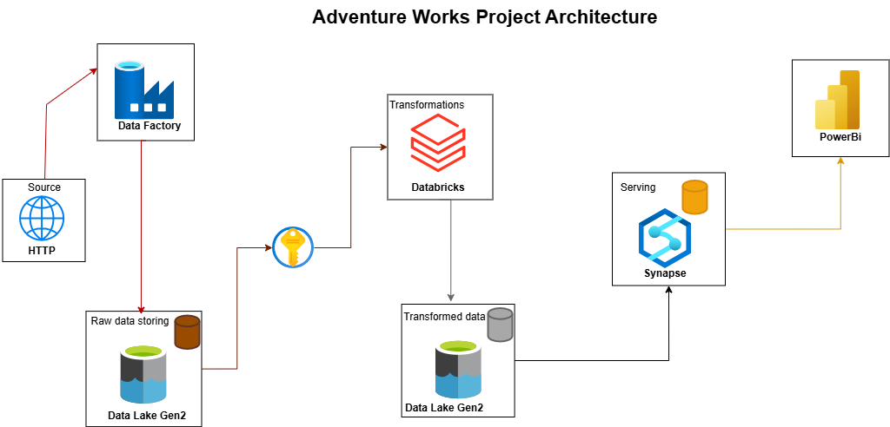

# Git-Integrated ADF Project

## 📌 Overview

This project demonstrates a complete data pipeline based on the **Medallion Architecture** using Azure services. It integrates **Git with Azure Data Factory (ADF)** for version control, uses **Azure Data Lake Storage (ADLS)** for layered data storage, performs transformations using **Azure Databricks**, and builds analytical views using **Azure Synapse Analytics**.

---

## 🔁 Architecture Workflow

---

## 🔧 Components Used

### ✅ Azure Data Factory (ADF)
- Git integration via HTTPS for version control and collaboration.
- Pipelines ingest raw files into **ADLS Bronze layer**.

### ✅ Azure Data Lake Storage (ADLS)
- **Bronze Layer**: Stores raw data as-ingested.
- **Silver Layer**: Stores cleaned, transformed data in **Parquet format**.
- **Gold Layer**: Stores final structured tables ready for analytics.

### ✅ Azure Databricks
- Reads data from **Bronze layer**.
- Performs cleaning, joining, and business rule transformations.
- Writes to **Silver layer** in Parquet format.

### ✅ Azure Synapse Analytics
- Connected to Silver layer using **external tables**.
- Uses **dedicated SQL pool** to:
  - Create **schemas**, **views**, and **external tables**.
  - Load transformed data into **Gold layer** in table format using **CTAS**.

---

## ✨ Key Features

- End-to-end integration using Azure-native tools.
- Follows **Medallion architecture**: Bronze → Silver → Gold.
- Efficient transformations using **Databricks notebooks**.
- Optimized storage with **Parquet** files.
- Fast querying and modeling in **Synapse SQL Pools**.

